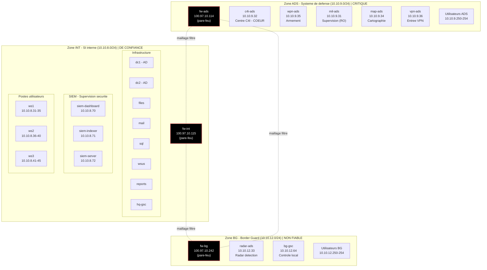
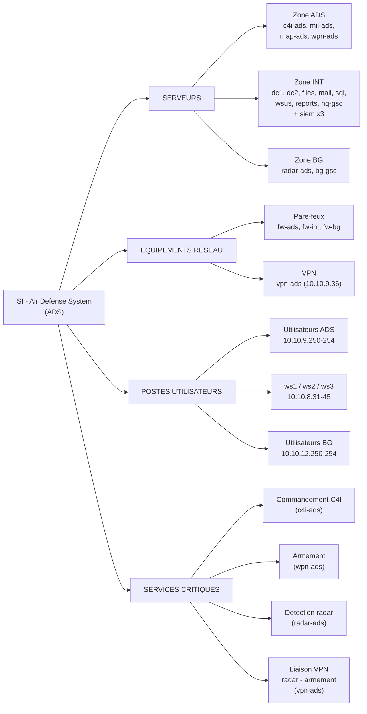
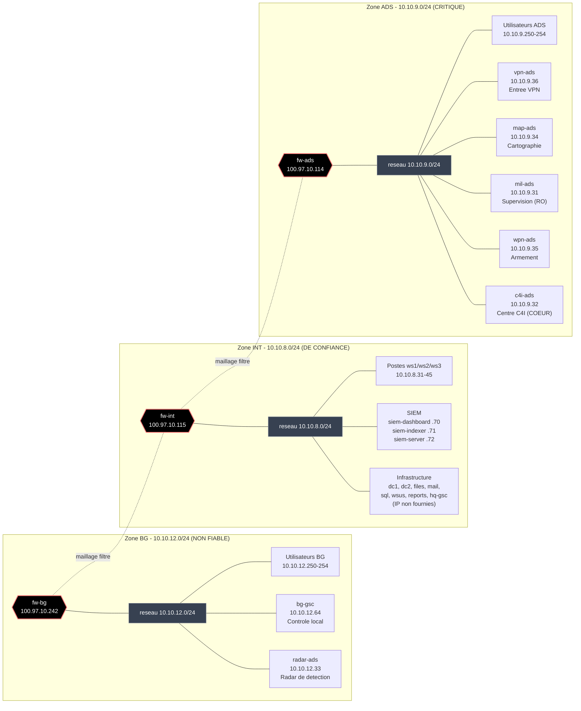

# Cartographies des actifs — Système ADS

> Représentations visuelles accompagnant l'analyse ([`01_analyse.md`](01_analyse.md)).
> Trois vues complémentaires, toutes en **Mermaid** (sources éditables dans `diagrammes/`).
>
> Voir aussi : [`00_README.md`](00_README.md) (vue d'ensemble et glossaire) et [`03_inventaire_actifs.md`](03_inventaire_actifs.md) (inventaire détaillé).

---

## Vue 1 — Vue logique par zones

**Objectif :** organisation des actifs par zone (ADS / INT / BG) et regroupement logique (infrastructure, SIEM, postes).
Source : [`diagrammes/vue_logique_zones.mmd`](diagrammes/vue_logique_zones.mmd)

## Vue 2 — Vue inventaire par catégorie d'actif

**Objectif :** classification transversale par type (serveurs, réseau, utilisateurs, services), indépendamment des zones.
Source : [`diagrammes/vue_inventaire_categories.mmd`](diagrammes/vue_inventaire_categories.mmd)

## Vue 3 — Vue physique / réseau

**Objectif :** rattachement de chaque actif à son réseau et à son pare-feu de zone (lecture « infrastructure »).
Source : [`diagrammes/vue_physique.mmd`](diagrammes/vue_physique.mmd)

---

## Note de lecture

- **Code couleur** : noir = pare-feu · gris = segment réseau. Les autres actifs ne sont pas colorés.
- **Niveau de confiance des zones** : indiqué dans le titre de chaque zone (CRITIQUE / DE CONFIANCE / NON FIABLE), tel que désigné par le contexte.
- **Services critiques** (vue inventaire) : commandement C4I, armement, détection radar et liaison VPN radar–armement.
- **Hexagones** `{{ }}` (vue physique) = pare-feux ; **pointillés** = maillage entre pare-feux (élément structurel ; détail des flux en TP2).
- Aucune adresse IP n'a été inventée : les serveurs INT sans IP fournie sont indiqués comme tels.
