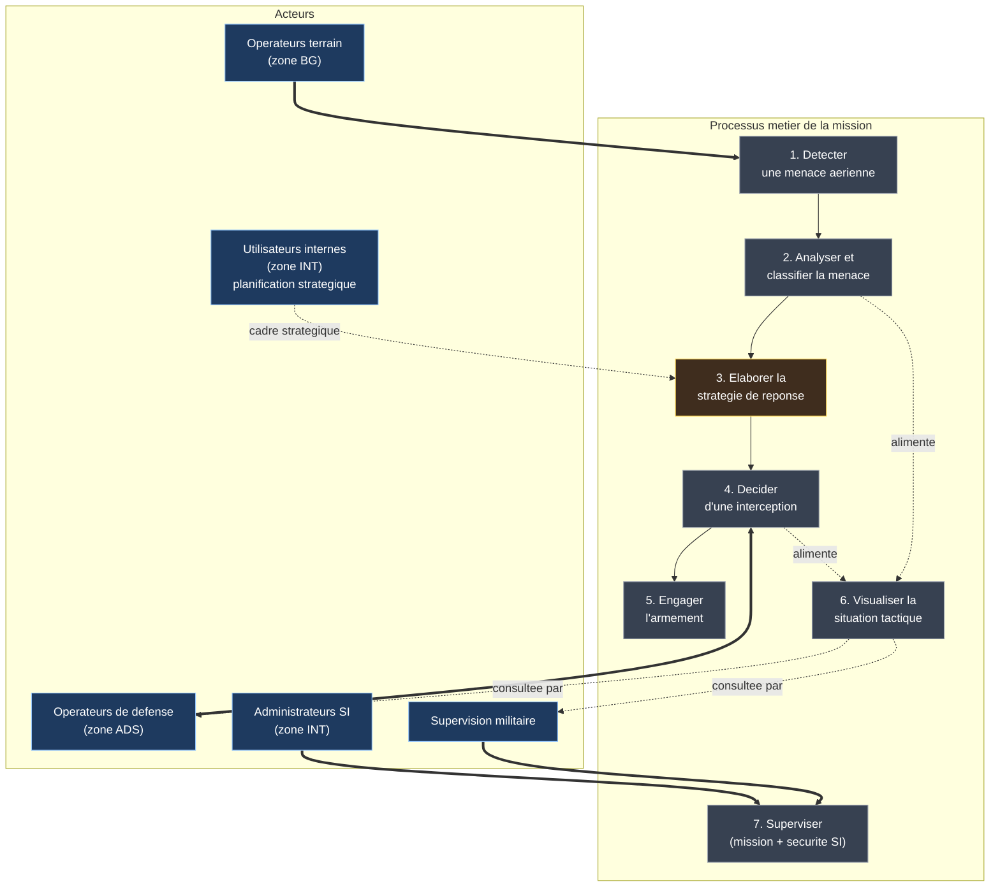
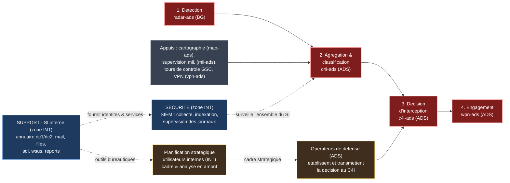

# Vues métier et fonctionnelle — Système ADS

> Ce document complète la cartographie des actifs par deux vues de plus haut niveau,
> demandées pour mieux comprendre le SI : une **vue métier** (la mission et ses acteurs)
> et une **vue fonctionnelle** (les capacités du système). Elles ne décrivent pas les
> machines : la correspondance avec les actifs concrets est donnée en fin de document.
>
> Voir aussi : [`00_README.md`](00_README.md) (vue d'ensemble et glossaire), [`01_analyse.md`](01_analyse.md) (analyse des actifs), [`02_cartographies.md`](02_cartographies.md) (vues techniques) et [`03_inventaire_actifs.md`](03_inventaire_actifs.md) (inventaire).

---

## 1. Vue métier

La vue métier décrit le SI du point de vue de la **mission** — la défense anti-aérienne —
indépendamment de toute considération technique. Elle répond à la question : *quelles
activités sont réalisées, et par qui ?*

### 1.1 Les processus de la mission

La mission s'enchaîne en une séquence d'activités, depuis la détection jusqu'à
l'engagement, avec en parallèle la visualisation de la situation et la supervision :

1. **Détecter** une menace aérienne — acquisition par le radar, en zone de terrain.
2. **Analyser et classifier** la menace — qualification de la cible.
3. **Élaborer la stratégie de réponse** — définition de la conduite à tenir, en amont de la décision.
4. **Décider** d'une interception — choix tactique centralisé.
5. **Engager l'armement** — exécution de la décision.
6. **Visualiser la situation tactique** — support cartographique alimenté en continu.
7. **Superviser** — suivi de la mission et de la sécurité du SI.

L'élaboration de la stratégie fait intervenir deux contributions de natures différentes :
les **opérateurs de défense (zone ADS)** ont un rôle direct — ils établissent la décision et
la transmettent au C4I ; les **utilisateurs internes (zone INT)** apportent une réflexion et
une planification stratégique en amont, sans diriger de flux opérationnel vers le C4I.

### 1.2 Les acteurs

| Acteur | Rôle dans la mission |
|--------|----------------------|
| Opérateurs terrain (zone BG) | Mettent en œuvre la détection au plus près du terrain |
| Opérateurs de défense (zone ADS) | Conduisent l'analyse, établissent la décision et la transmettent, engagent l'armement |
| Utilisateurs internes (zone INT) | Apportent une planification stratégique en amont de la décision |
| Supervision militaire | Suit le déroulement de la mission (en lecture seule) |
| Administrateurs SI (zone INT) | Assurent le bon fonctionnement et la supervision de sécurité |

### 1.3 Diagramme

---

## 2. Vue fonctionnelle

La vue fonctionnelle décompose le SI en **fonctions** (blocs de capacités) et fait le pont
entre le métier et la technique. Elle répond à la question : *qu'est-ce que le système sait
faire ?* — sans encore préciser sur quelle machine chaque fonction s'exécute.

### 2.1 Regroupement par domaine

Les fonctions se répartissent en domaines. Pour chacune, le tableau précise son **rôle** et
**ce qu'elle alimente** (à qui elle transmet son résultat, et où). Les alimentations
reprennent les flux décrits dans le contexte, exprimés au niveau fonctionnel (le détail des
ports et protocoles est documenté séparément).

**Domaine opérationnel — Défense (zones ADS / BG)**

| Fonction (actif) | Rôle | Alimente… (quoi → qui / où) |
|------------------|------|------------------------------|
| Détection (`radar-ads`, BG) | Acquiert les pistes aériennes au plus près du terrain | Les **pistes radar** → l'agrégation (`c4i-ads`, ADS) |
| Agrégation & classification (`c4i-ads`, ADS) | Fusionne les données reçues et qualifie la menace | La **menace classifiée** → la fonction de décision (même cœur `c4i-ads`) |
| Commandement & décision (`c4i-ads`, ADS) | Décide de l'interception | L'**ordre d'engagement** → l'armement (`wpn-ads`) ; la **décision tactique** → la visualisation (`map-ads`) |
| Engagement armement (`wpn-ads`, ADS) | Exécute l'ordre de tir | Effet terminal (fin de chaîne ; pas d'alimentation interne au SI) |
| Visualisation cartographique (`map-ads`, ADS) | Fournit le fond de situation tactique | Le **fond cartographique** → l'agrégation (`c4i-ads`) et l'affichage des opérateurs |
| Supervision militaire (`mil-ads`, ADS) | Observe la situation en lecture seule | Des **consignes de supervision** → le cœur (`c4i-ads`) |

**Tours de contrôle — Coordination (GSC)**

Les composants `gsc` sont à comprendre comme des **tours de contrôle** : ils coordonnent et
relaient l'information, sans porter eux-mêmes la décision d'interception.

| Fonction (actif) | Rôle | Alimente… |
|------------------|------|-----------|
| Tour de contrôle terrain (`bg-gsc`, BG) | Coordonne l'activité de la zone BG et relaie la situation du terrain | La **situation terrain** → la détection locale, puis remontée → la tour centrale |
| Tour de contrôle centrale (`hq-gsc`, INT) | Assure la coordination centrale du dispositif | La **coordination** → la fonction de décision (`c4i-ads`) |

**Domaine sécurité (zone INT)**

| Fonction (actif) | Rôle | Alimente… |
|------------------|------|-----------|
| Collecte des journaux (`siem-server`) | Reçoit les logs émis par l'ensemble du SI | Les **journaux bruts** → l'indexation (`siem-indexer`) |
| Indexation (`siem-indexer`) | Structure et rend exploitables les événements | Les **événements structurés** → le tableau de bord (`siem-dashboard`) |
| Supervision sécurité (`siem-dashboard`) | Présente l'état de sécurité et lève les alertes | Des **alertes** → les administrateurs SI (zone INT) |

**Domaine support — SI interne (zone INT)**

| Fonction (actif) | Rôle | Alimente… |
|------------------|------|-----------|
| Authentification & annuaire (`dc1`, `dc2`) | Identifie utilisateurs et machines du domaine | L'**identité/les droits** → tous les services INT ; les **journaux** → le SIEM |
| Messagerie (`mail`) | Échange de courriels | Les utilisateurs internes |
| Partage de fichiers (`files`) | Stockage et partage documentaire | Les utilisateurs internes |
| Base de données (`sql`) | Stockage structuré des données applicatives | Les applications internes (ex. reporting) |
| Mise à jour des postes (`wsus`) | Distribue les mises à jour | Les postes `ws1`/`ws2`/`ws3` |
| Reporting (`reports`) | Produit des rapports | Les administrateurs / le service central |

**Fonctions transverses**

| Fonction (actif) | Rôle | Alimente… |
|------------------|------|-----------|
| Interconnexion sécurisée VPN (`vpn-ads`, ADS) | Achemine les flux distants de façon chiffrée | Les **flux distants sécurisés** → le cœur (`c4i-ads`) |
| Filtrage inter-zones (`fw-ads`, `fw-int`, `fw-bg`) | Contrôle tous les échanges entre zones | Sert de point de passage à l'ensemble des flux inter-zones |

**Niveau stratégique (humain)**

Au-dessus des fonctions automatisées, deux fonctions portées par des acteurs humains
alimentent la décision, avec des rôles distincts :

| Fonction (acteurs) | Rôle | Alimente… |
|--------------------|------|-----------|
| Décision opérationnelle (opérateurs ADS) | Établissent la décision d'interception et la transmettent | La **décision** → le commandement (`c4i-ads`) — lien direct |
| Planification stratégique (utilisateurs INT) | Élaborent un cadre et une analyse stratégique en amont | Le **cadre stratégique** → les opérateurs ADS — contribution indirecte, sans flux opérationnel vers le C4I |

### 2.2 Diagramme

---

## 3. Correspondance fonction → actif

Ce tableau relie les fonctions de la vue fonctionnelle aux actifs concrets de l'inventaire.
Il fait le lien entre ce document et la cartographie des actifs ([`03_inventaire_actifs.md`](03_inventaire_actifs.md)).

| Fonction | Actif(s) porteur(s) | Zone |
|----------|---------------------|------|
| Détection (acquisition radar) | `radar-ads` | BG |
| Agrégation & classification | `c4i-ads` | ADS |
| Commandement & décision | `c4i-ads` | ADS |
| Engagement de l'armement | `wpn-ads` | ADS |
| Visualisation cartographique | `map-ads` | ADS |
| Supervision militaire | `mil-ads` | ADS |
| Collecte des journaux | `siem-server` | INT |
| Détection d'incidents | `siem-server` | INT |
| Supervision sécurité (tableau de bord) | `siem-dashboard`, `siem-indexer` | INT |
| Authentification & annuaire | `dc1`, `dc2` | INT |
| Messagerie | `mail` | INT |
| Partage de fichiers | `files` | INT |
| Base de données | `sql` | INT |
| Mise à jour des postes | `wsus` | INT |
| Reporting | `reports` | INT |
| Interconnexion sécurisée (VPN) | `vpn-ads` | ADS |
| Filtrage inter-zones | `fw-ads`, `fw-int`, `fw-bg` | (périmètre) |
| Tour de contrôle terrain | `bg-gsc` | BG |
| Tour de contrôle centrale | `hq-gsc` | INT |
| Décision opérationnelle | Opérateurs de défense (postes ADS) | ADS |
| Planification stratégique | Utilisateurs internes (postes `ws1`/`ws2`/`ws3`) | INT |

> Les composants `gsc` jouent le rôle de **tours de contrôle** : `bg-gsc` (zone BG)
> coordonne le terrain et relaie la situation vers le commandement, tandis que `hq-gsc`
> (zone INT) assure la coordination centrale du dispositif. Ils n'exécutent pas la décision
> d'interception (qui revient à `c4i-ads`) mais orchestrent la circulation de l'information.

---

## 4. Articulation des deux vues

La vue métier dit **pourquoi** et **par qui** : la mission de défense et ses acteurs. La
vue fonctionnelle dit **quoi** : les capacités mobilisées pour réaliser cette mission. La
cartographie des actifs (documents 01 à 03) dit **avec quoi** et **où** : les machines, les
adresses et les zones. Lues ensemble, ces trois niveaux offrent une compréhension complète
du SI, du besoin métier jusqu'à l'implémentation technique.
