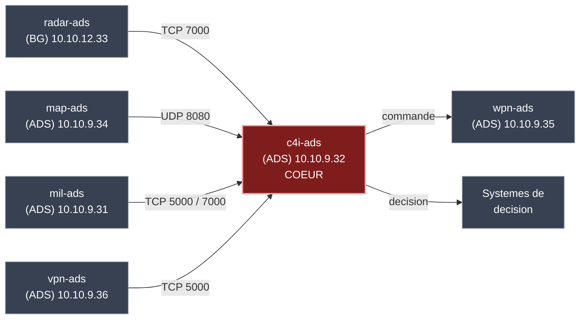
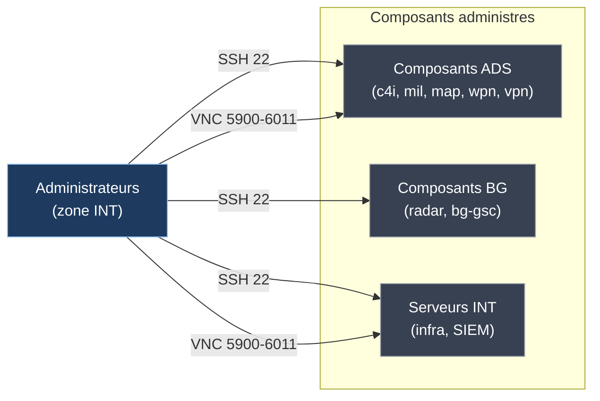
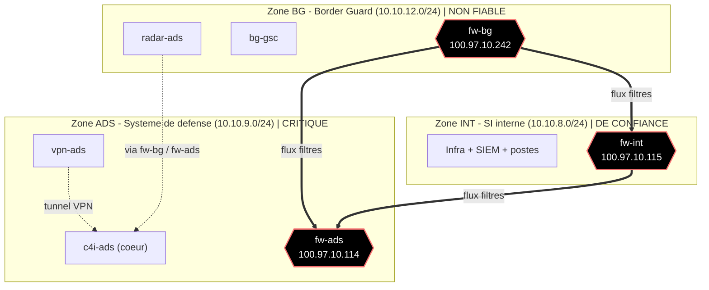

# Cartographies des flux et des zones — Air Defense System (ADS)

> Représentations visuelles accompagnant la documentation ([`01_analyse_flux_zones.md`](01_analyse_flux_zones.md)).
> Flux (vues 1 et 2) et zones de confiance (vue 3) sont présentés séparément.
> Sources éditables dans `diagrammes/`.

---

## Vue 1 — Flux réseau entre composants

**Objectif :** communications opérationnelles et de commandement, avec sens, protocoles et ports.
Source : [`diagrammes/vue_flux_composants.mmd`](diagrammes/vue_flux_composants.mmd)

---

## Vue 2 — Flux administratifs

**Objectif :** accès de gestion (SSH, VNC), de nature transverse, isolés pour la lisibilité.
Source : [`diagrammes/vue_flux_admin.mmd`](diagrammes/vue_flux_admin.mmd)

---

## Vue 3 — Zones de confiance et interconnexions

**Objectif :** zones, frontières, pare-feux, points d'interconnexion et accès VPN.
Source : [`diagrammes/vue_zones_confiance.mmd`](diagrammes/vue_zones_confiance.mmd)

---

## Note de lecture

- **Flèches pleines** = flux ou interconnexions ; **étiquettes** = protocole/port quand connu.
- **Pointillés** = liens spécifiques (tunnel VPN, flux inter-zone passant par les pare-feux).
- **Hexagones** = pare-feux ; **rouge** = cœur `c4i-ads`.
- Les ports ne sont indiqués que lorsqu'ils sont fournis par le contexte.
